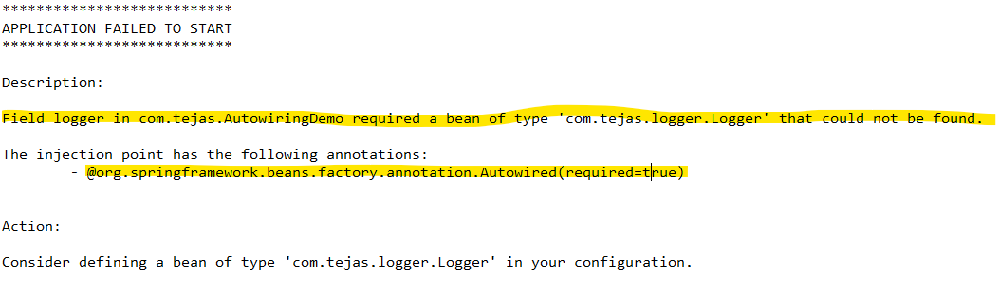
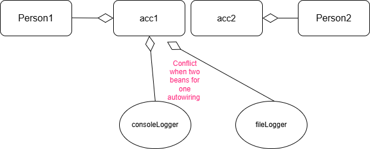
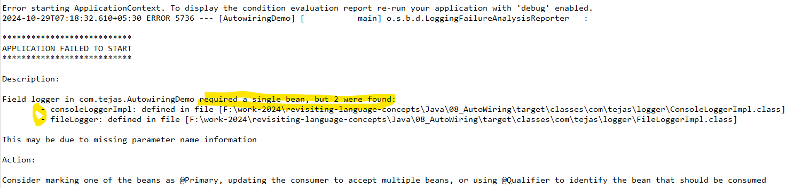
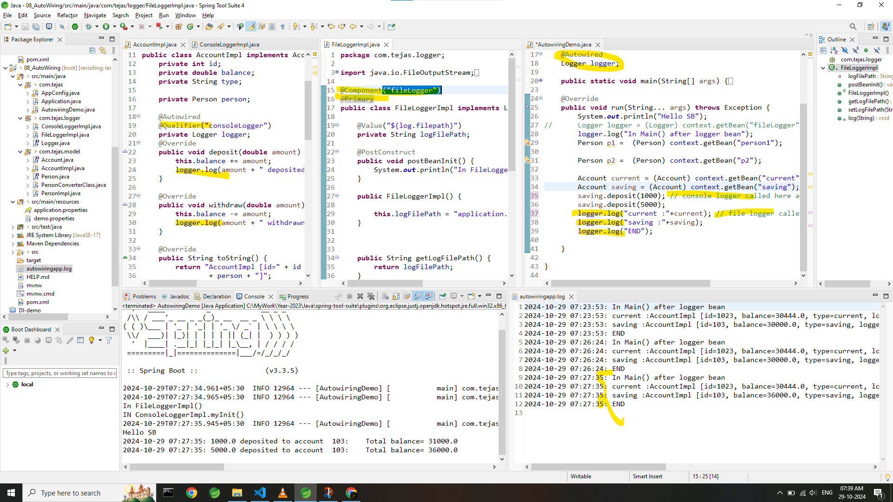

## AutoWiring 
-  Autowiring is a feature in the Spring Framework that allows **the automatic injection of dependencies into a Spring bean** without explicitly specifying the configuration
-  Reducing the need for manual @Bean configurations and XML wiring.
-  IN Earlier demos although spring container doing DI but we were somehow giving inputs in app.config or with properties file to what fields to be taken while injecting bean (Person bean injecting inside Account bean) 
---
### **Types of Autowiring **
#### **1. Setter level : setter based DI**
```java
@Component("book")
public class BookImpl implements Book {
	private String bookName;
	private Author author; // Author is injected via setter
	private double price;

	@PostConstruct
	public void initPost() {System.out.println("Called BookImpl class @PostConstruct ");}
	public BookImpl() {System.out.println("In BookImpl()");}

	@Autowired // SETTER BASED DI
	public void setAuthor(Author author) {
		System.out.println("********* In BookImpl.setAuthor()  Setter based Autowiring   *********");
		this.author = author;
	}
   //other getter and setter
}
```
- Note :
   1. Spring creates the instance (bean) of the class using its default (no-argument) constructor. The dependencies (like Author in your example) are not yet injected into the object. The object is in a partially initialized state.
   2. After creating the object, Spring looks for methods annotated with @Autowired. In this case, it finds the setter method setAuthor(Author author).
   3. The Spring framework resolves the Author bean from its application context (bean container). It finds the appropriate Author instance.
   4. Spring calls the setter method setAuthor() and injects the resolved Author bean as the argument.
- Setter based DI allows for more flexibility in how and when dependencies are injected compared to field-based DI.

--- 
#### **2. Constructor based :  contructro based DI**
```java
@Autowired
public Book(Author author) {
   this.bookName = "Spring in Action";
   this.author = author;
   this.price = 29.99;
}  
```
- Sequence : 
   - the application starts -> Spring scans the classpath for beans
   -  finds the Author and Book components
   -  Book class has a constructor marked with @Autowired with Author parameter to be injected
   -  Spring container (application context) checks if we have Type Author bean -> if YES Proceed else Exception
   -  Spring calls the Book class constructor -> assigned author field of the book -> initialization completes -> bean registration done ->  Book bean available to use if one needs.

- Advantages :  
   1. Immutability : Unlike field based di, Constructor-Based DI ***allows you to mark fields as final, making them immutable***, since they are set once during object creation.
   The Book constructor requires the Author object, which Spring resolves before calling the constructor.
   2. Dependencies are ***injected when the object is created***. (in field based it happens after object creation)
   3. Also Constructor-Based DI ***can help catch circular dependencies*** during the object creation process.

#### **3. field based  : field based DI**
```java
@Autowired
private Author author;
```
####  **Field Injection vs Constructor Injection (Best practices)**
- **Field Injection:** Using @Autowired directly on fields is convenient but considered less flexible in terms of testing and immutability.
- **Constructor Injection:** Encouraged as a best practice because it ensures that all dependencies are provided when the object is created, promoting immutability and easier testing.
Practical Tip: Use constructor injection in your Spring components for better maintainability and testability.

``` .......... ends here types of autowiring .......... ```

### **Make Autowiring Optional To Inject Bean**
#### *Exception : no bean found*

- **Use `@Autowired(required=false)` for a Default Bean:**
```java
	@Autowired(required=false)
	Logger logger;
```
- You can mark a bean as optional by setting required=false **or using java.util.Optional**
---
#### **Multiple beans of the same type**
When you have **multiple beans of the same type** (e.g., different implementations of an interface) and need to control which one should be injected into your components.


### When to Use `@Primary` and `@Qualifier` in Autowiring


1. **Use `@Primary` for a Default Bean:**
   - **When:** One of the beans should act as the default choice across your application when multiple beans exist.
   - **How:** Annotate the preferred default bean with `@Primary`. This ensures it is injected when no specific bean is qualified.
  

2. **Use `@Qualifier` for Specific Beans:**
   - **When:** You need to inject a **specific bean** in certain places, even if a default (`@Primary`) bean exists.
   - **How:** Use `@Qualifier` to explicitly specify which bean to inject.

#### **When to Apply This Approach:**
- **Multiple Implementations**: When your application has different implementations of an interface or class (e.g., `PrimaryService`, `SecondaryService`) and you need to inject the right one in different contexts.
- **Default vs Specific Needs**: Use `@Primary` for common cases and `@Qualifier` for more specific needs.

#### **Exception came with multiple beans**


#### **Code snippet**


---

 
