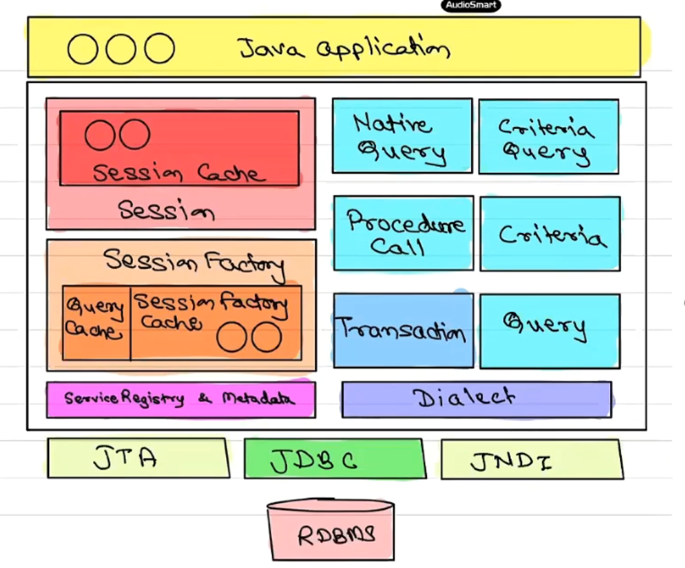
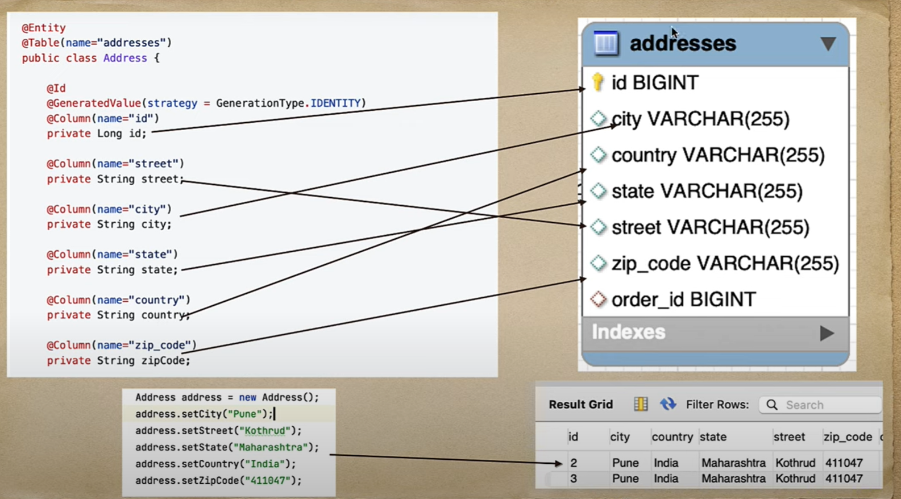

## HIBERNATE BASICS 
- Reference Link : https://docs.jboss.org/hibernate/stable/orm/userguide/html_single/Hibernate_User_Guide.html#architecture-overview


1. Object Relational Mapping : a programming technique that connects object-oriented programming (OOP) code with a relational database

2. Benefits of ORM :
    - To address, access, and manipulate objects without needing to consider how they relate to their data sources.
    - Removing the need for boilerplate code 
    - ORMs can help with code reuse. 
    - Help maintaining an application over time. 
3. Drawback : impedance mismatch
4. Hibernate is popular ORM tool. others are iBatis,EclipseLink
5. JPA is specification(contract) for ORM tools
6. OOP : RDBMS Mapping
    - **Class** : Table  
    - **Object of class** : Row of table  
    - **Fields of class** : columns of table
---





---


---

#### **Hibernate Architecture**
-  It is designed such that to abstract the complexities of database interactions, allowing developers to work with objects in Java rather than dealing directly with SQL and database tables.
1. Configuration Object
    - hibernate.cfg.xml file
    - responsible for creating `SessionFactory`
    - loads the database connection settings, Hibernate properties, and class-to-table mappings from the configuration file.

2. **SessionFactory :**
    - The `SessionFactory` is a thread-safe, immutable object that acts as a factory for creating `Session` objects.
    - One SessionFactory (SF) per application(per db).
    - SessionFactory is heavy object so practice to make singleton class
    - DriverManager.getConnection() in jdbc makes connection (using sockets across tcp ip) --- Session is created by SF to wrapper these activities 


3. **Session :** 
    -  Represents a single unit of work with the database.
    - You can multiple sessions by SF method call
    - it encapsulates jdbc connection
    - session is lightweight hence created and destroyed for single transaction
    - not a thread-safe
    - use cases : 
        1. Managing CRUD operations on persistent entities.
        2. Holding a temporary cache during the lifecycle of a session. 

4. **Transaction :** 
    - The Transaction object allows the application to commit or roll back changes made within a session in a safe way.
    - abstracts the underlying database transactions (such as BEGIN, COMMIT, ROLLBACK)
    ```java
    Transaction tx = session.beginTransaction();
    // Perform operations
    tx.commit(); 
    ```

5. **Query Object :**
    - Hibernate supports two types of queries:
        1. HQL :  similar to SQL but works with objects, not tables.
        2. Native SQL querings
- Sql based native queries also called if complexity is hight. there are also hibernate query language(hql)
- In case of SPs, Procedure call is wrapper on callable statement.


6. Criteria Object (deprecated,not expected )
    - more programmatic way to build dynamic queries in Hibernate. 
    ```java
    Criteria criteria = session.createCriteria(Employee.class);
    criteria.add(Restrictions.eq("empid", 101));
    List<Employee> employees = criteria.list();
    ```

7. Hibernate Dialect
    - Dialect class is responsible for generating appropriate SQL queries for the target database.
    - Specific to the underlying database (e.g., MySQL, PostgreSQL, Oracle). 
    ```xml
    <property name="hibernate.dialect">org.hibernate.dialect.MySQLDialect</property>
    ```
8. Connectip  provider
    - By default, Hibernate uses JDBC connections, but you can configure other connection pool providers like HikariCP.

9. Entity Classes (POJOs)
    -  represent the business model in the application.
    - Each entity class is mapped to a table in the database

    
```mathematica
Application
    ↓
Configuration (hibernate.cfg.xml)
    ↓
SessionFactory (Singleton, Thread-Safe)
    ↓
Session (Not Thread-Safe)
    ↓            → Transaction
Query/Criteria   → Execute SQL (HQL, Native Queries)
    ↓
Database (CRUD operations)
    ↓
Session Close

```
---
Hibernate crud methods
- get()
- save()
- update()
- delete()
---

```java
public class HBUtils{
    private static SessionFactory factor;
    static{
        try{
            Configuration config =  new Configuration();
            config.configure("hibernate.cfg.xml"); // hibernate.cfg.xml is properties file where database & hibernate configurations saved

            ServiceRegistry serviceRegistry = new StandardServiceRegistryBuilder()
                                                                .applySettings(config.getProperties())
                                                                .build();

            factory = config.buildSessionFactory();
        }
        catch(Exception e){
            e.printstacktrace()
        }
   }

   public static SessionFactory getSessionFactory(){
    return factory;
   }

   public static void shutdown(){
    factory.close();
   }
}
```
### About hibernate.cfg.xml :
- below are some properties from xml file we consider configuring hibernate connection
```xml
<!-- JDBC Database connection settings -->
      <property name="hibernate.connection.driver_class">org.postgresql.Driver</property>
      <property name="hibernate.connection.url">jdbc:postgresql://localhost:5432/mydb</property>
      <property name="hibernate.connection.username">myuser</property>
      <property name="hibernate.connection.password">mypassword</property>
<!-- Hibernate properties -->
      <property name="hibernate.dialect">org.hibernate.dialect.PostgreSQLDialect</property>
      <property name="hibernate.hbm2ddl.auto">update</property>
      <property name="hibernate.show_sql">true</property>
      <property name="hibernate.format_sql">true</property>
```
---

- In spring boot Hibernate is auto configured using JPA hence above xml content not used
```properties
spring.datasource.url=jdbc:postgresql://localhost:5432/mydb
spring.datasource.username=myuser
spring.datasource.password=mypassword
spring.jpa.hibernate.ddl-auto=update
spring.jpa.show-sql=true

```
- Spring Boot handles the configuration of EntityManagerFactory(SessionFactor), EntityManager(Session), and Hibernate properties without needing the explicit hibernate.cfg.xml file.

### `factory.getCurrentSession()` vs `factory.openSession()`
In Hibernate, both `factory.getCurrentSession()` and `factory.openSession()` are used to obtain a `Session`, but they have key differences in terms of lifecycle management and use cases. Understanding their differences helps determine which one is preferred in a given context.

---

### **1. `factory.getCurrentSession()`**
- **Lifecycle Management**: Sessions obtained via `getCurrentSession()` are **bound to the current transaction** and automatically closed once the transaction completes.
- **Transaction Dependency**: Requires a transaction to be started (`beginTransaction()`).
- **Thread Safety**: The session is tied to the current thread and not thread-safe across multiple threads.
- **Ease of Use**: Ideal for transactional code where you don’t want to manually manage the session lifecycle.
- **Configuration**: Requires `hibernate.current_session_context_class` to be set in your configuration (e.g., `thread` or `jta`).
```xml
<property name="hibernate.current_session_context_class">thread</property>
```

```java
Session session = factory.getCurrentSession();
session.beginTransaction();
MyEntity entity = session.get(MyEntity.class, 1);
session.getTransaction().commit(); // Session is automatically closed here.
```
---

### **2. `factory.openSession()`**
- **Lifecycle Management**: Sessions obtained via `openSession()` need to be **manually closed** after use, even if a transaction is committed.
- **Transaction Independence**: Can be used without starting a transaction, but typically requires transaction management for data modifications.
- **Thread Safety**: Not thread-safe; each call to `openSession()` creates a new session.
- **Flexibility**: Useful for non-transactional operations or cases where you want complete control over the session lifecycle.

```java
Session session = factory.openSession();
Transaction transaction = session.beginTransaction();
MyEntity entity = session.get(MyEntity.class, 1);
transaction.commit();
session.close(); // Must be closed explicitly.
```
---
### **Which One to Prefer?**
#### **`factory.getCurrentSession()`**:
- Preferred when using **transactional, request-scoped, or short-lived operations**.
- Suitable for applications with a **transaction-per-request pattern**, as the session lifecycle is automatically managed.
- Simplifies code by reducing the need for explicit session management.

#### **`factory.openSession()`**:
- Preferred for **long-running operations** or use cases where a session needs to be managed across transactions.
- Useful in situations where the session’s lifecycle is not tied to the transaction or where more explicit control is needed (e.g., batch processing).

---

### HQL (Hibernate query language)
- It is an OO Query language that is similar to SQL but operates on Hibernate's persistent objects rather than directly on database tables.

- demo example

    ```java
    // Setting up HBUtils.java for getting session factory -> session
    public class HBUtils {

        private static SessionFactory sessionFactory = createSessionFactory();

        private static ServiceRegistry serviceRegistry;

        private static SessionFactory createSessionFactory() {
            serviceRegistry = new StandardServiceRegistryBuilder().configure().build();

            Metadata metadata = new MetadataSources(serviceRegistry).buildMetadata();

            return metadata.getSessionFactoryBuilder().build();
        }

        public static void shutdown() {
            if (sessionFactory != null) {
                sessionFactory.close();
            }
            if (serviceRegistry != null) {
                StandardServiceRegistryBuilder.destroy(serviceRegistry);
            }
        }

        public static SessionFactory getSessionFactory() {
            return sessionFactory;
        }

        // IF you are using getCurrentSession() transaction management is must refer notes above
        public static void beginTransaction() {
            Session session = sessionFactory.getCurrentSession();
            session.getTransaction().begin();
        }
        
        public static void commitTransaction() {
            Session session = sessionFactory.getCurrentSession();
            session.getTransaction().commit();
        }
        
        public static void rollBackTransaction() {
            Session session = sessionFactory.getCurrentSession();
            session.getTransaction().rollback();
        }

    }


    // Book model
    @Entity
    @Table(name = "book_table")
    public class Book {
        @Id
        @GeneratedValue(strategy = GenerationType.AUTO)
        private int id;
        @Column(name = "book_name")
        private String bookName;
        private String author;
        private double price;
        private float rating;
        @Temporal(TemporalType.DATE)
        @Column(name = "release_date")
        private Date releaseDate;
        private String  category;

        public Book() {

        }
        // parameterized contructor getter and setters + toString 
        }

    class Main{
    public static void main(String[] args) {
            BookDaoImpl bookDao = new BookDaoImpl();
    try {
                System.out.println("HI");
                HBUtils.beginTransaction();

                // get books where category = "Fiction"
                List<Book> bookList = bookDao.getByCategory("Fiction");
                System.out.println(bookList);
                HBUtils.commitTransaction();
            } catch (Exception e) {
                HBUtils.rollBackTransaction();
            }

    }
    }
    // BookDaoImpl.java
    public List<Book> getByCategory(String category) {
            Session session = factory.getCurrentSession();
            String hq = "from Book b where b.category = :category";
            
            Query  query =  session.createQuery(hq,Book.class);
            query.setParameter("category", category);
            return query.getResultList();
        }
    ```