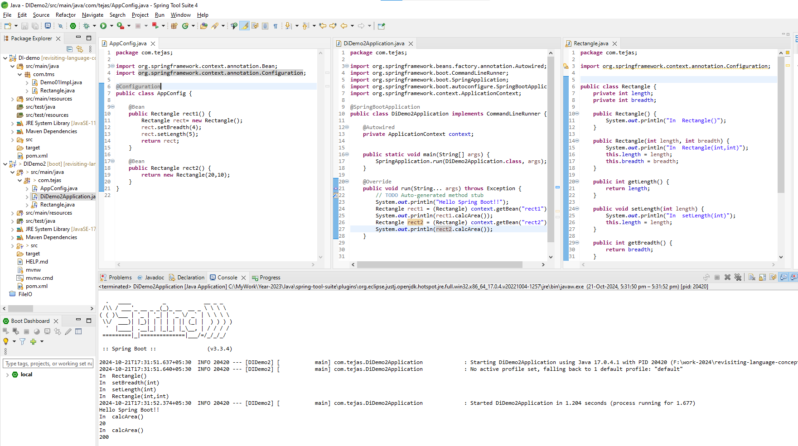
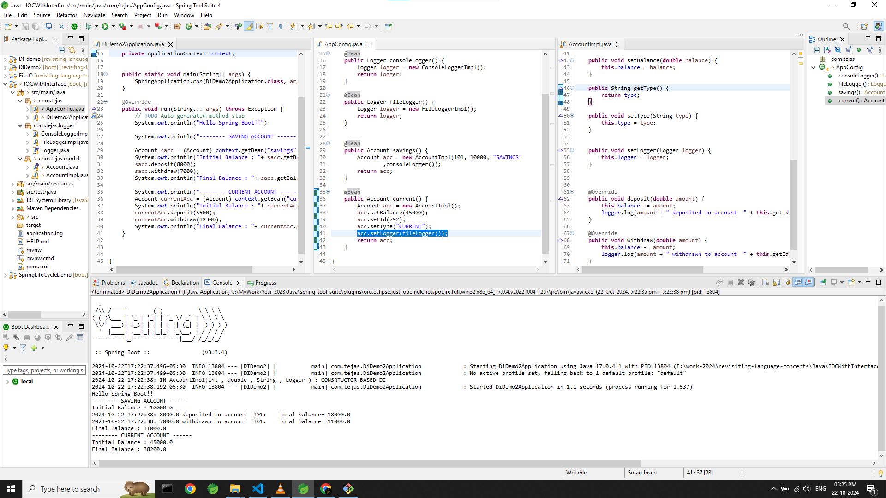

### OOP -> Composition
1. where one object contains one or more objects of other classes as part of its state. 
2. Suitable when you want to compose complex behavior from simpler, independent objects

3. Inheritance = Hierarchial Relationship , Composition = modular 
----
### Dependency Injection : 
---


```java
Car punch =  new Car();
punch.setEngine();
punch.setChassis();
punch.setGear()

// business need
punch.drive();
```
- Utility Methods like setting modular objects which is OUTER REQUIREMENT AND NOT CORE BUSINESS NEED as below

- Business Logic methods are using utility object to serve BUSINESS NEED

---
- Purpose : Used to decouple(LOOSE COUPLING) object creation and dependencies, provide flexibility (i.e dependencies can be changed or swapped easily without modifying the class), testing, and maintainability.
- More flexible than OOP composition, as dependencies can be changed or swapped easily without modifying the class.
- Dependency Injection : About setting up required things which are outer requirement & not core business logic
- **OUTER OBJECT & INNER OBJECT in OOP**
- **Dependency object & Dependent Object in Spring**

### DI is referred as a type of IOC (Inversion of control) :
- In General Code ,An object is responsible for obtaining its dependencies and managing its lifecycle
- With IoC, The class doesn't control the creation of its dependencies; they are injected from the outside.
- outside means - (Spring or other framework) controls the creation, configuration, and lifecycle of objects.
- external entity (like a framework) takes responsibility for providing dependencies.
> Q. Spring Container is called IOC Container Why?

> ANALOGY  
***Think of a restaurant:***
Without IoC: The chef (your class) buys ingredients (dependencies), prepares the meal, and serves it.
With IoC/DI: The chef is simply given ingredients by a delivery service (IoC container), and the chef just prepares the meal.

```
Dependency Injection is one way to achieve Inversion of Control, there are several other design patterns that also invert control:

Event-Driven Architecture (Callback Pattern) - control to event  
Observer Pattern - In the Observer pattern, the control over when to notify the observers is inverted
```
=========================
## Three ways of DI : 
1. Setter based DI
```xml
<?xml version="1.0" encoding="UTF-8"?>
<beans xmlns="http://www.springframework.org/schema/beans" xmlns:xsi="http://www.w3.org/2001/XMLSchema-instance" xsi:schemaLocation="
        http://www.springframework.org/schema/beans http://www.springframework.org/schema/beans/spring-beans.xsd">
	<!-- Setter based DI -->
	<bean id="rect1" class="com.tms.Rectangle">
		<property name="length" value="10" />
		<property name="breadth" value="5" />
	</bean>
</beans>
```

2. Constructor based DI
```xml
<?xml version="1.0" encoding="UTF-8"?>
<beans xmlns="http://www.springframework.org/schema/beans" xmlns:xsi="http://www.w3.org/2001/XMLSchema-instance" xsi:schemaLocation="
        http://www.springframework.org/schema/beans http://www.springframework.org/schema/beans/spring-beans.xsd">
<!-- Ctor based DI -->
	<bean id="rect2" class="com.tms.Rectangle">
		<constructor-arg index="0" value="20" />
		<constructor-arg index="1" value="10" />
	</bean>
</beans>
```

```java

	public static void main(String[] args) {
		
		// Dependency Injected Demo
		ClassPathXmlApplicationContext context = new ClassPathXmlApplicationContext("beans.xml");
		
		// rect 2 is created is using property i.e setter based DI (refer beans.xml
		Rectangle rect1 = (Rectangle) context.getBean("rect1");
		System.out.println(rect1.calcArea());
		
		
		// rect 2 is created is using contructor-arg i.e constructor based DI
		Rectangle rect2 = (Rectangle) context.getBean("rect2");
		System.out.println(rect2.calcArea());

		context.close();
	}
```
- Below image see: 
	1. rect1, rect2 bean are defined in a @Configuration class using a @Bean method. At runtime, Spring will invoke that method and create an instance of Rectangle (or retrieve an already created instance if the bean is singleton-scoped). 
	2. When you call context.getBean("rect1"), Spring looks up the bean named rect1 in the ApplicationContext.




3. Field based DI : 


Bean lifecycle :
1. **Bean Instantiation**: Spring creates the bean.
2. **Dependency Injection**: Spring injects dependencies or properties.
3. **Custom Initialization**: Any initialization logic runs (optional).
4. **Ready for Use**: The bean is fully configured and can be used.
5. **Destruction**: Cleanup happens before the bean is removed (optional).

---
Interfaces Usecase:
